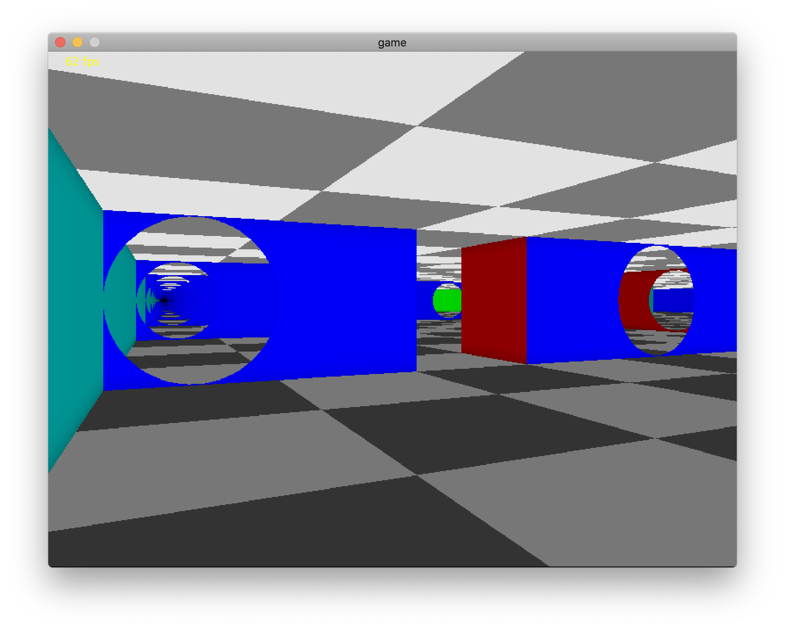

# Ray Casting With Portals

This repo contains sample code from an early prototype of [Gate Escape](https://blog.sb1.io/gateescape/). There are likely bugs and other issues since the actual game was totally rewritten in c. Do not expect good performance as I learned early on that Kotlyn and other GC'd languages are not good choices for software render engines. However this should run fine on most modern PCs and a good place to experiment! 

### Movement
WSAD

### Settings
You can change key engine parameters starting [here](https://github.com/gh123man/Raycaster/blob/master/src/Game.kt#L28)
Change the number of threads to the number of cores in your machine for best performance. 

The map can be modified and portals can be placed on any wall facing any cardinal direction. 
