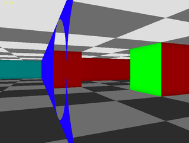

# Ray Casting With Portals

  

This repo contains sample code from an early prototype of [Gate Escape](https://blog.sb1.io/gateescape/). There are likely bugs and other issues since the actual game was totally rewritten in c. Do not expect good performance as I learned early on that Kotlin and other GC'd languages are not good choices for software render engines. However this should run fine on most modern PCs and a good place to experiment! 

## How does it work?

Raycasing is a pseudo-3D rendering technique that uses rays cast from the player or camera to the walls in the scene. Raycasting is like ray tracing except rays are only cast horizontally across the frame (once for each column of pixels) instead of one for each pixel. Columns are then drawn vertically across the screen proportional to the distance the ray traveled. As a result, it is very performant for a pure software renderer, however it has many limitations (you can never look up and down).

If you don't already know much about raycasting I highly recommend this classic tutorial: https://lodev.org/cgtutor/raycasting.html 

Aside from the obvious limitations, some things are actually much easier to do via raycasting than with traditional raster render systems such as windows, mirrors, and portals. This project is an example of how a portal raycaster could be implemented. 

  

# How to use this repo

### Building
Clone the repo and open in intellij

### Movement
WSAD

### Settings
You can change key engine parameters starting [here](https://github.com/gh123man/Raycaster/blob/master/src/Game.kt#L28)
Change the number of threads to the number of cores in your machine for best performance. 

The map can be modified and portals can be placed on any wall facing any cardinal direction. 

## One laast GIF because it's cool

  

