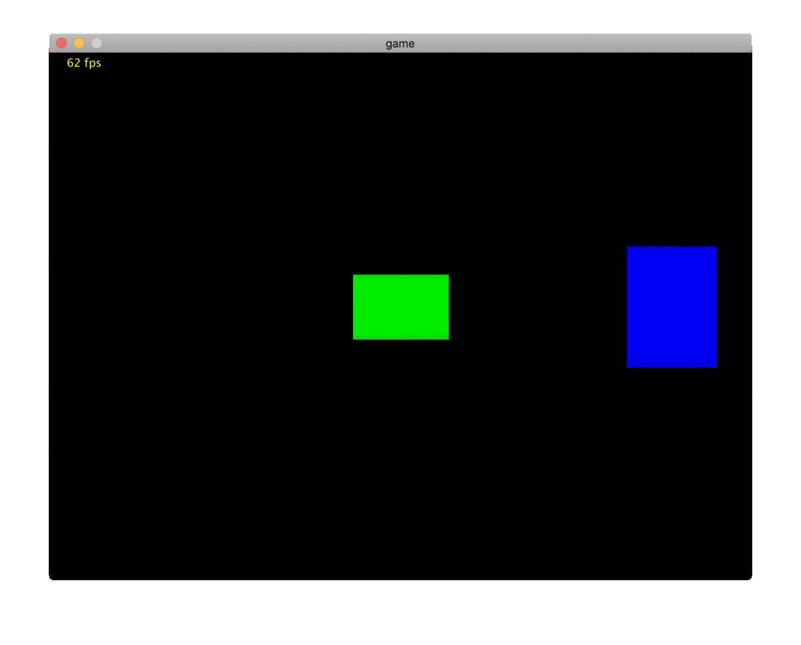

# Raycasting Portals

  

This repo contains sample code from an early prototype of [Gate Escape](https://blog.sb1.io/gateescape/). There are likely bugs and other issues since the actual game was totally rewritten in c. Do not expect good performance as I learned early on that Kotlin and other GC'd languages are not good choices for software render engines. However this should run fine on most modern PCs and a good place to experiment! 

# How does it work?

Raycasing is a pseudo-3D rendering technique that uses rays cast from the player or camera to the walls in the scene. Raycasting is like ray tracing except rays are only cast horizontally across the frame (once for each column of pixels) instead of one for each pixel. Columns are then drawn vertically across the screen proportional to the distance the ray traveled. As a result, it is very performant for a pure software renderer, however it has many limitations (you can never look up and down).

If you don't already know much about raycasting I highly recommend this classic tutorial: https://lodev.org/cgtutor/raycasting.html 

Aside from the obvious limitations, some things are actually much easier to do via raycasting than with traditional raster render systems such as windows, mirrors, and portals. This project is an example of how a portal raycaster could be implemented. 

## Casting Rays 

When a ray is cast from the camera, it either terminates on a wall, or passes through a portal. When a ray hits a portal a second ray needs to be cast from the exit portal. So we will end up with 1 or more rays for each column of pixels on the screen. The rays are stored in a buffer ordered from first to last in casting order (starting at the camera)

  

When a ray is cast from a portal, it is broke into 2 parts. 

  

a: the ray cast from the portal exit to the next wall

b: the complete length of the ray used for calculating the actual distance the wall is from the player. 

The "a" component is used for collision detection. We would not want to detect walls between the false camera and the exit portal. 

The "b" component is used just for measuring the height of the wall slice we need to draw proportional to the length of the ray. 

## Rendering 

Once the ray buffer is built via either hitting a non-portal wall, or hitting the cast depth limit, the ray buffer is drawn by the renderer. The renderer reads the ray buffer back to front and starts drawing the furthest away walls first. 

This GIF gives a rough idea of the order in which things are drawn.

1. walls
2. floors/ceilings 
3. masks (portal holes)

These 3 steps are repeated for each ray that was cast until we reach the first ray that was cast from the player camera.  

  

## Performance 

It probably sounds like this would have terrible performance. What if rays pass through lots of portals and bounce all over the place? Or what if two portals are pointed at each other? 

It actually is not an issue at all. In this engine walls must be at the very least 1 unit apart in order for portals to face each other which due to the spread of rays from the camera causes fewer rays to hit a given wall the further you are from it. So as the nested portal depth grows, the number of rays passing through that portal shrinks. Drawing is so much more expensive than casting, that every wall in the game could be a portal and you likely would not see any performance impact at all!

There are of course some cases where a max depth will be needed to prevent an infinite casting loop. I use a depth of 100 since its more than enough to never see the end of a portal tunnel like this:

  

# How to use this repo

### Building
Clone the repo and open in intellij

### Movement
WSAD

### Settings
You can change key engine parameters starting [here](https://github.com/gh123man/Raycaster/blob/master/src/Game.kt#L28)
Change the number of threads to the number of cores in your machine for best performance. 

The map can be modified and portals can be placed on any wall facing any cardinal direction. 

## One last GIF because it's cool!
